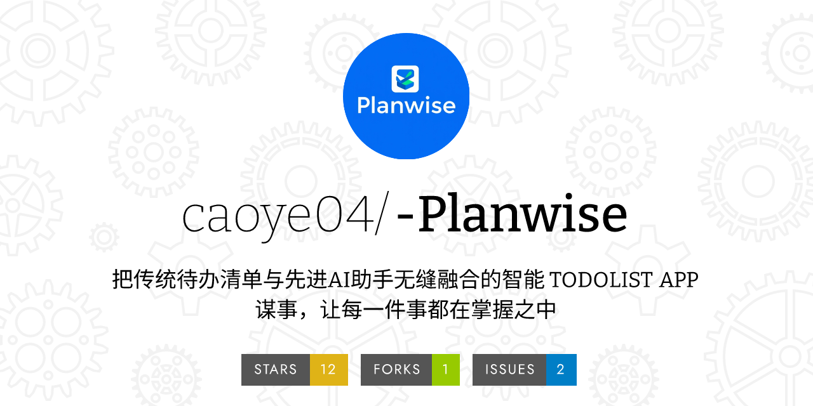

# Planwise用户手册

## 引言

Planwise是一款简洁高效的个人日程管理应用，帮助用户轻松管理待办事项。本手册将详细介绍应用的各项功能及使用方法。

## 目录

[toc]

## 1. 快速入门

### 1.1 首次使用

1. 下载并安装Planwise应用
2. 启动应用，进入主界面
3. 熟悉底部导航栏的三个主要功能区：
	- 待办列表
	- 日程
	- 我的

### 1.2 界面导览

- **待办列表**：查看和管理所有待办事项
- **日程**：以日历形式查看安排
- **我的**：管理个人设置和云同步

## 2. 基础功能

### 2.1 待办事项管理

#### 添加新待办

1. 点击界面右下角的"+"按钮
2. 填写待办事项信息：
	- 标题（必填）
	- 描述（选填）
	- 日期和时间
	- 地点
	- 选择分类标签
3. 点击"保存"完成创建

#### 查看待办详情

1. 点击待办事项进入详情页
2. 查看完整信息：
	- 标题
	- 描述
	- 时间地点
	- 分类标签
	- AI建议

#### 删除待办

- 方式一：左右滑动待办事项
- 方式二：在详情页点击删除图标

#### 完成待办

- 点击待办事项前的复选框
- 或在详情页切换完成状态

### 2.2 筛选功能

#### 基础筛选

点击顶部筛选选项：

- 全部
- 未完成
- 已完成

#### 高级筛选

点击筛选图标，选择：

1. 今日待办
2. 近三天待办
3. 本周待办
4. 按时间筛选
5. 按标签筛选

#### 时间筛选

1. 选择"按时间筛选"
2. 设置起始时间
3. 设置结束时间
4. 点击确定

#### 标签筛选

1. 选择"按标签筛选"
2. 从现有标签中选择
3. 查看筛选结果

### 2.3 日历功能

#### 查看日程

1. 切换到"日程"标签
2. 在日历上选择日期
3. 查看当天安排

#### 日期导航

- 左右滑动切换月份
- 点击日期直接跳转
- 查看每日待办数量

## 3. 高级功能

### 3.1 云同步

#### 设置服务器

1. 进入"我的"页面
2. 点击"设置服务器地址"
3. 输入服务器IP和端口
4. 确认保存

#### 同步操作

- **上传本地数据**：
	1. 点击"将本地数据同步到云"
	2. 等待同步完成
	3. 查看同步结果
- **下载云端数据**：
	1. 点击"将云数据同步到本地"
	2. 确认覆盖本地数据
	3. 等待同步完成

### 3.2 AI智能助手

#### 获取建议

1. 进入待办事项详情页
2. 点击"问问PlanWiseAI的建议"
3. 等待AI分析
4. 查看智能建议

#### 建议内容

AI会根据以下因素给出建议：

- 任务类型
- 时间安排
- 地点
- 优先级
- 相关经验

### 3.3 标签管理

#### 创建新标签

1. 添加待办时点击"新增标签"
2. 输入标签名称
3. 确认创建

#### 使用标签

- 添加待办时选择标签
- 通过标签筛选待办
- 查看同类事项

## 4. 常见问题解答

Q: 如何删除已创建的待办事项？

> A: 可以左右滑动待办事项，或在详情页点击删除图标。

Q: 如何快速查找特定待办？

> A: 可以使用筛选功能，通过时间、标签等方式快速定位。

Q: 云同步失败怎么办？

> A: 检查网络连接和服务器地址是否正确，然后重试。

Q: 数据同步会覆盖原有数据吗？

> A: 是的，请在同步前确保数据已备份。

Q: AI建议功能无响应？

> A: 请检查网络连接，或稍后重试。

Q: 如何备份本地数据？

> A: 可以使用云同步功能将数据备份到云端。

## 使用小贴士

1. 定期同步数据，避免数据丢失
2. 合理使用标签，便于管理和查找
3. 养成及时更新待办状态的习惯
4. 充分利用AI助手获取建议
5. 使用日历视图更直观地安排时间

## 注意事项

1. 首次使用请设置正确的服务器地址
2. 同步操作前确保网络稳定
3. 重要数据建议定期备份
4. 请勿重复创建相同的标签
5. AI建议仅供参考，具体安排请结合实际情况

## 获取帮助

如果您在使用过程中遇到任何问题，可以：

1. 查看本用户手册
2. 参考常见问题解答
3. 联系开发团队获取支持 https://github.com/caoye04/-Planwise/issues