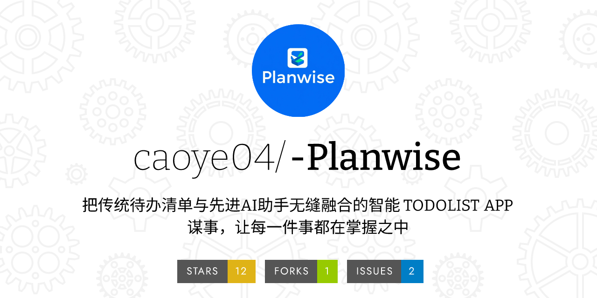

# Planwise项目管理材料

[toc]

## 一、项目分工规划

### 1. 核心团队成员

- 曹烨
- 杨清华

### 2. 具体分工

#### 曹烨

**职责范围：**

1. 项目整体管理与协调
	- 制定项目计划
	- 跟踪项目进度
	- 协调团队合作
2. 技术架构设计
	- MVVM架构搭建
	- 数据库设计
	- API接口设计
3. 功能模块开发
	- 云端同步功能
	- AI智能助手
	- 整体优化
4. 文档编写
	- 技术文档
	- 项目报告
	- 展示材料

#### 杨清华

**职责范围：**

1. 用户界面设计
	- UI界面设计
	- 交互流程设计
	- 视觉风格定义
2. 前端功能实现
	- 界面开发
	- 动画效果
	- 用户体验优化
3. 功能模块开发
	- 待办事项管理
	- 日程管理
	- 筛选功能
4. 文档编写
	- 技术文档
	- 项目报告
	- 项目DEMO

## 二、进度规划与完成情况

### 1. 第一阶段：项目启动（3月底）

**计划内容：**

- 建立代码仓库
- 完成品牌设计
- 确定技术栈

**完成情况：**

 ✅ 按期完成GitHub仓库建立
 ✅ 完成项目Logo与品牌设计
 ✅ 确定使用Android Studio + Java开发
 ✅ 选定Django作为后端框架

### 2. 第二阶段：中期检查（4月上旬）

**计划内容：**

- 准备检查文档
- 完成项目提案
- 通过审核评估

**完成情况：**

 ✅ 按时提交中期检查文档
 ✅ 顺利通过项目审核
 ✅ 获得老师和助教建议与反馈

### 3. 第三阶段：基础开发（4月中旬）

**计划内容：**

- 搭建Android框架
- 设计产品界面
- 实现基础功能

**完成情况：**

 ✅ 完成MVVM架构搭建
 ✅ 实现主要界面设计
 ✅ 完成数据库设计
 ✅ 建立基础代码规范

### 4. 第四阶段：功能开发（4月下旬）

**计划内容：**

- 开发核心功能
- 实现界面交互
- 完成基础测试

**完成情况：**

 ✅ 完成待办事项管理功能
 ✅ 实现日历视图功能
 ✅ 完成筛选功能
 ✅ 实现基础数据存储

### 5. 第五阶段：体验优化（5月初）

**计划内容：**

- 优化用户体验
- 完善功能细节
- 进行性能优化

**完成情况：**

 ✅ 优化界面交互效果
 ✅ 完善错误提示机制
 ✅ 改进数据加载性能
 ✅ 优化应用响应速度

### 6. 第六阶段：功能集成（5月上旬）

**计划内容：**

- 实现云端同步
- 集成AI功能
- 完成最终测试

**完成情况：**

 ✅ 完成云端数据同步
 ✅ 集成DeepSeek AI助手
 ✅ 实现智能建议功能
 ✅ 完成综合测试

## 三、项目里程碑

### 1. 重要节点

- 3月25日：项目正式启动
- 4月10日：通过中期检查
- 4月20日：完成基础框架
- 4月30日：完成核心功能
- 5月5日：完成体验优化
- 5月12日：完成所有功能

### 2. 成果交付

- 可运行的Android应用程序
- 完整的技术文档
- 用户使用手册
- 项目展示PPT
- 项目源代码与说明

## 四、执行效果评估

### 1. 进度完成情况

- 总体进度符合预期
- 各阶段任务按时完成
- 核心功能全部实现
- 质量符合项目要求

### 2. 团队协作情况

- 沟通顺畅有效
- 分工明确合理
- 互相配合默契
- 解决问题及时

### 3. 项目亮点

- 采用先进技术栈
- 实现AI智能助手
- 用户体验优秀
- 功能完整实用

### 4. 存在的问题

- 部分细节需要优化
- 性能还可提升
- 用户引导待完善
- 测试覆盖不够全面