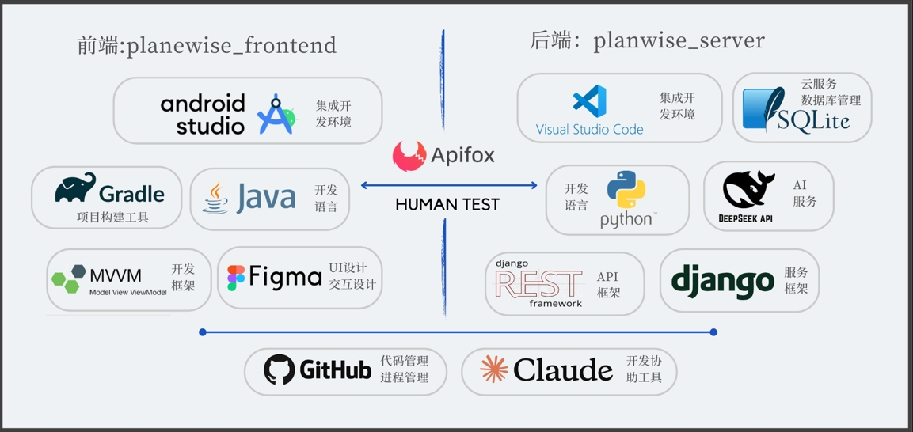

# Planwise设计文档

[toc]

## 1. 项目概述

### 1.1 项目背景

Planwise是一款待办事项管理应用，旨在帮助用户高效管理个人日程和任务。该应用采用前后端分离架构，前端使用Android Studio + Java开发，后端使用Django框架开发。

### 1.2 技术架构

- 前端：Android Studio + Java
	- 采用MVVM架构模式
	- 使用AndroidX组件库
	- 使用Room持久化库
	- 使用Retrofit网络请求库
- 后端：Django + SQLite
	- 采用REST架构
	- 使用Django REST framework

## 2. 核心功能设计

### 2.1 待办事项管理

**功能描述**：

- 添加、编辑、删除待办事项
- 设置待办事项的标题、描述、时间、地点、分类标签
- 标记待办事项的完成状态

**技术实现**：

- 使用Room数据库存储本地待办事项数据
- 使用RecyclerView展示待办事项列表
- 采用MaterialDesign组件实现UI交互

### 2.2 多维度筛选

**功能描述**：

- 按完成状态筛选(全部/未完成/已完成)
- 按时间范围筛选
- 按分类标签筛选
- 快速筛选（今日/近三天/本周）

**技术实现**：

- 使用ChipGroup实现筛选选项
- 使用LiveData实现数据实时更新
- 采用Repository模式处理数据筛选逻辑

### 2.3 日历视图

**功能描述**：

- 日历形式展示待办事项
- 查看特定日期的待办事项列表
- 直观显示每日任务数量

**技术实现**：

- 使用CalendarView组件
- 结合RecyclerView显示日程列表
- 使用ViewModel管理日历数据

### 2.4 云同步功能

**功能描述**：

- 本地数据上传至云端
- 从云端同步数据到本地
- 支持配置服务器地址

**技术实现**：

- 使用Retrofit进行网络请求
- 采用RESTful API设计
- 实现数据冲突处理机制

### 2.5 AI建议功能

**功能描述**：

- 基于待办事项内容提供智能建议
- 考虑时间、地点等因素生成建议
- 提供任务执行的参考意见

**技术实现**：

- 集成DeepSeek API
- 采用异步请求处理
- 实现错误处理和重试机制

## 3. 技术特点

### 3.1 架构设计

- 采用MVVM架构，实现界面与业务逻辑分离
- 使用Repository模式统一管理数据来源
- 采用单Activity多Fragment的界面结构

### 3.2 数据存储

- 使用Room数据库实现本地持久化
- 支持SQLite数据库的增删改查
- 实现数据库迁移策略

### 3.3 网络通信

- 使用Retrofit+OkHttp实现网络请求
- 采用RESTful API设计规范
- 实现请求缓存和错误重试

### 3.4 UI设计

- 遵循Material Design设计规范
- 实现响应式布局
- 支持深色模式适配

## 4. 组员分工

### 4.1 曹烨

1. 项目整体框架设计
	- 搭建MVVM架构
	- 设计数据模型
	- 配置开发环境
2. 云端功能实现
	- 开发同步接口
	- 实现数据传输
	- 处理同步冲突
3. AI功能开发
	- 集成DeepSeek API
	- 实现智能建议
	- 优化响应处理
4. 用户友好性优化
	- 实现操作提示
	- 优化交互流程
	- 添加动画效果

### 4.2 杨清华

1. UI界面设计
	- 设计界面布局
	- 实现MaterialDesign风格
	- 优化用户体验
2. 待办事项管理功能
	- 实现CRUD操作
	- 开发列表展示
	- 添加手势操作
3. 日程功能开发
	- 实现日历视图
	- 开发日程管理
	- 优化时间显示
4. 筛选功能实现
	- 开发多维筛选
	- 实现快速筛选
	- 优化筛选性能

## 5. 总结

本项目采用现代化的技术栈和架构设计，实现了一个功能完整、体验良好的待办事项管理应用。通过合理的分工协作，团队成员各司其职，共同推进项目的开发进度。项目的技术实现符合软件工程规范，具有良好的可维护性和扩展性。
