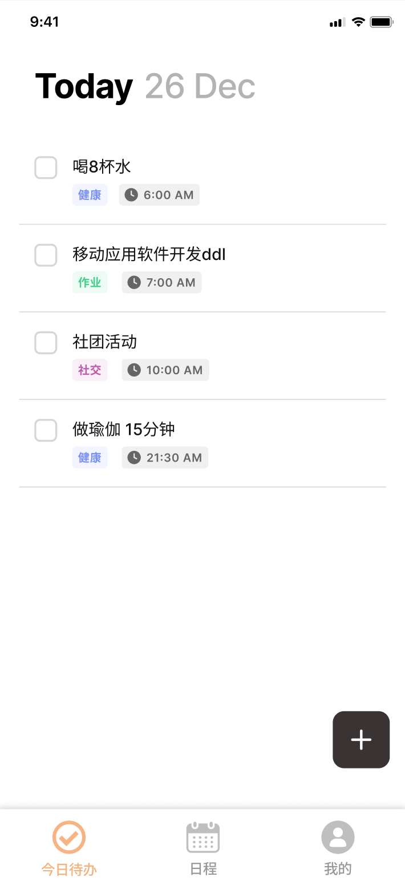
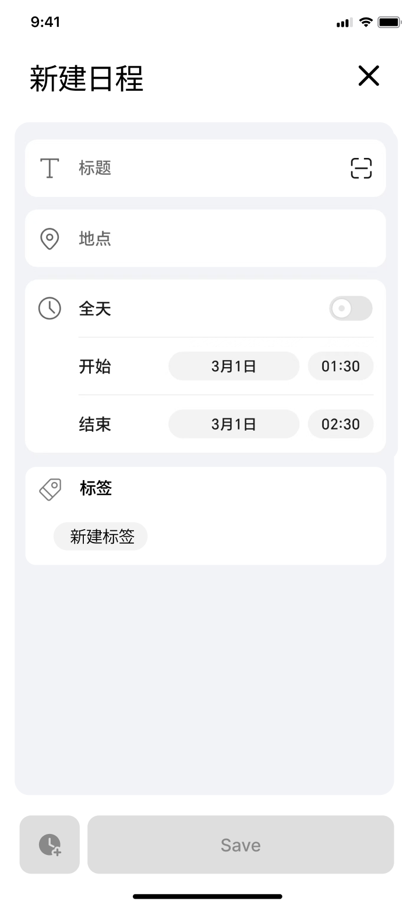
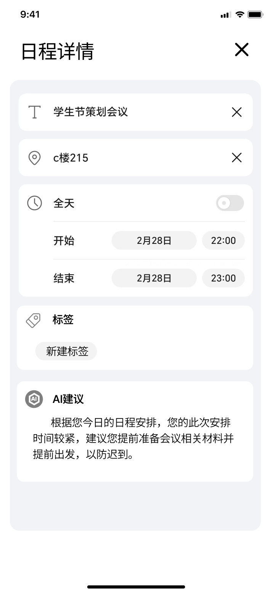
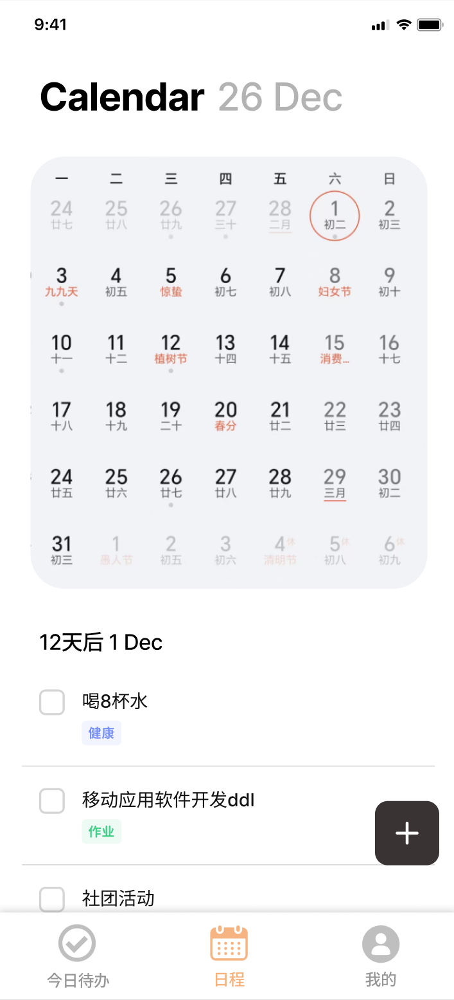

# 谋事（Planwise）| 界面设计文档

[toc]

## 〇、项目背景与定位

**谋事(Planwise)** 是一款革新任务管理体验的智能待办事项应用，将传统待办清单与先进AI助手无缝融合。它不仅帮助用户记录任务，更能理解任务上下文，提供个性化完成建议，智能分析时间模式，并与用户建立对话式互动。

通过精心设计的分类系统、灵活的时间管理工具和直观的用户界面，谋事让规划变得既高效又愉悦。无论是处理日常琐事、管理工作项目还是协调个人目标，谋事都能成为您的得力助手，帮助您更智慧地规划时间，更从容地完成任务。

**谋事，让每一件事都在掌握之中。**

## 一、界面设计

### 1. 今日待办
用户可以通过前面的checkbox选择该日程是否已完成。

#### a. 新建日程
在 **“今日待办”** 界面，点击右下方加号（+）即可跳转到 **“新建日程”** 界面。

#### b. 日程详情
在 **“今日待办”** 界面，点击日程对应条目，即可跳转到 **“日程详情”** 界面。
在该界面，我们的**ai小助手**会智能分析今日日程，给出合理的建议。

### 2. 日程
在 **“日程”** 界面，您可以通过在日历中点击对应日期，来查看当天的待办及其完成情况

### 3. 我的
在 **“我的”** 界面，您可以进行登录、登出和一些基本的设置操作。

