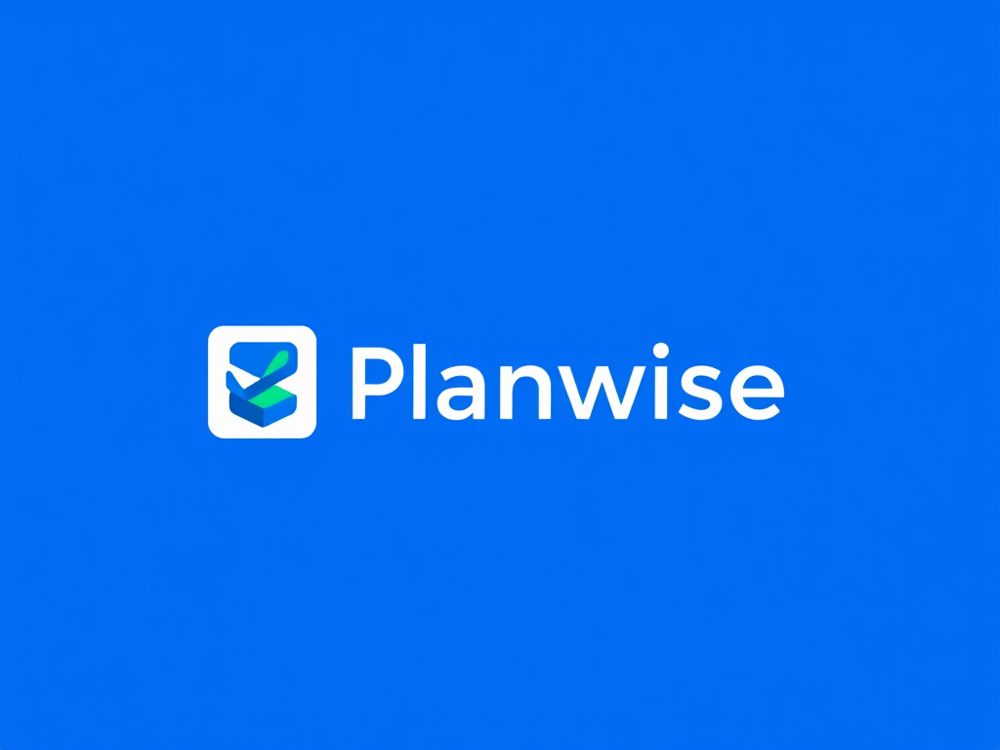

# 谋事（Planwise）| 项目关键Activity设计与实现文档

[toc]

## 〇、项目背景与定位

**谋事(Planwise)** 是一款革新任务管理体验的智能待办事项应用，将传统待办清单与先进AI助手无缝融合。它不仅帮助用户记录任务，更能理解任务上下文，提供个性化完成建议，智能分析时间模式，并与用户建立对话式互动。

通过精心设计的分类系统、灵活的时间管理工具和直观的用户界面，谋事让规划变得既高效又愉悦。无论是处理日常琐事、管理工作项目还是协调个人目标，谋事都能成为您的得力助手，帮助您更智慧地规划时间，更从容地完成任务。

**谋事，让每一件事都在掌握之中。

## 一、MainActivity

**功能描述**：
- 主Activity，作为应用的入口点
- 包含底部导航栏，用于在"今日待办"、"日程"和"我的"三个主要界面之间切换
- 负责加载初始化应用必要的数据和配置

**实现方式**：
- 使用BottomNavigationView实现底部导航
- 采用Fragment架构，各主要界面作为Fragment进行加载和切换
- 通过ViewPager2与BottomNavigationView联动，实现页面滑动切换
- 使用NavController管理导航逻辑

## 二、TodayTodoFragment (今日待办)

**功能描述**：
- 显示当日所有待办事项
- 提供快速完成/取消完成待办事项的功能
- 支持添加新待办事项和查看详情

**实现方式**：
- 使用RecyclerView展示待办事项列表
- 采用CardView设计每个待办事项卡片
- 实现ItemTouchHelper支持左右滑动删除功能
- 使用FloatingActionButton添加新待办事项

## 三、AddScheduleActivity (新建日程)

**功能描述**：
- 提供表单用于创建新的待办事项
- 支持设置标题、描述、日期时间、地点和分类标签
- 保存新建的待办事项到本地数据库

**实现方式**：
- 使用MaterialDatePicker和MaterialTimePicker选择日期和时间
- 采用自定义ChipGroup实现分类标签选择
- 使用PlacesAPI或自定义地点选择器实现地点选择
- 通过ViewModel进行数据处理和持久化

## 四、ScheduleDetailActivity (日程详情)

**功能描述**：
- 显示待办事项的详细信息
- 提供编辑和删除操作
- 集成AI小助手提供智能建议

**实现方式**：
- 使用ConstraintLayout构建详情页面布局
- 通过Intent接收待办事项ID并加载详细数据
- 实现本地AI模型或调用云端API提供智能建议
- 使用动画效果增强用户体验

## 五、CalendarFragment (日程)

**功能描述**：
- 提供月历视图展示各日期的待办事项情况
- 支持选择日期查看特定日期的待办事项
- 显示待办事项完成情况统计

**实现方式**：
- 使用第三方日历控件（如CalendarView或自定义控件）
- 实现日期标记功能，显示有待办事项的日期
- 使用RecyclerView展示选中日期的待办事项列表
- 通过Room数据库查询特定日期的待办事项

## 六、ProfileFragment (我的)

**功能描述**：
- 提供用户个人信息管理
- 支持登录、注册和退出登录
- 提供应用设置和数据同步选项

**实现方式**：
- 使用SharedPreferences存储用户偏好设置
- 实现Firebase Authentication或自定义认证系统
- 使用WorkManager实现后台数据同步
- 采用PreferenceFragmentCompat构建设置界面

## 七、数据层实现

**本地存储**：
- 使用Room数据库存储待办事项数据
- 设计Schedule实体类管理待办事项信息
- 实现DAO接口进行数据库操作

**云端同步**：
- 使用Retrofit与后端API交互
- 实现Repository模式管理本地和远程数据源
- 采用WorkManager处理定期同步和冲突解决

### 八、架构设计

**整体架构**：
- 采用MVVM架构模式
- 使用ViewModel管理UI相关数据
- 通过LiveData实现数据驱动的UI更新
- 使用Coroutines处理异步操作
- 采用依赖注入(Hilt/Dagger)简化组件间依赖

**组件交互**：
- Fragment间通过共享ViewModel通信
- Activity跳转通过Intent传递数据
- 使用EventBus或LiveData实现组件间事件通知