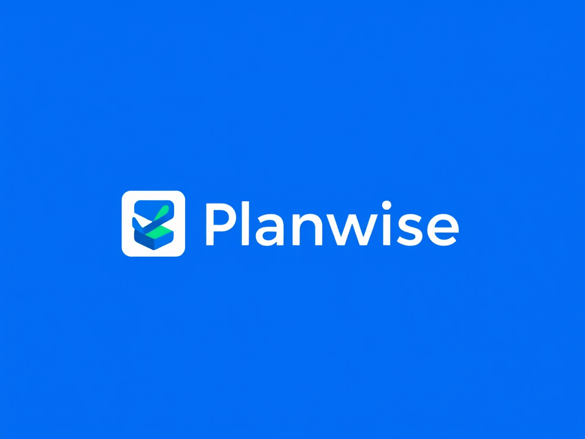

# 谋事 PlanWise | 项目重难点挑战分析文档

---

[toc]

---

## 〇、项目背景与定位

**谋事(Planwise)** 是一款革新任务管理体验的智能待办事项应用，将传统待办清单与先进AI助手无缝融合。它不仅帮助用户记录任务，更能理解任务上下文，提供个性化完成建议，智能分析时间模式，并与用户建立对话式互动。

通过精心设计的分类系统、灵活的时间管理工具和直观的用户界面，谋事让规划变得既高效又愉悦。无论是处理日常琐事、管理工作项目还是协调个人目标，谋事都能成为您的得力助手，帮助您更智慧地规划时间，更从容地完成任务。

**谋事，让每一件事都在掌握之中。**

## 一、 AI集成相关挑战

### 1.1 AI响应延迟问题

**问题描述**：
AI API请求响应时间不稳定，在网络条件差或服务负载高时可能出现3-5秒甚至更长的延迟，导致用户体验下降，尤其是在任务详情页面加载AI建议时，界面长时间处于等待状态。

**解决策略**：

1. **UI预加载与骨架屏**：
	- 实现骨架屏(Skeleton UI)显示，在AI内容加载期间提供视觉反馈
	- 使用淡入淡出动画平滑过渡，降低等待感知
2. **响应超时优化**：
	- 设置合理的超时阈值(如3秒)，超时后显示友好提示
	- 提供手动刷新选项，让用户控制重试时机

### 1.2 AI内容质量不稳定

**问题描述**：
 AI生成内容质量参差不齐，有时建议过于泛泛而谈，缺乏针对性；或者出现内容重复、逻辑不连贯等问题，影响用户对功能的信任度。

**解决策略**：

1. **提示工程优化**：
	- 精心设计输入提示(Prompt)，增加任务上下文信息，多次实验来保证prompt合适
	- 针对不同任务类型，使用专门定制的提示模板
2. **内容过滤机制**：
	- 设计最小内容标准，不满足则自动重新生成
3. **用户反馈闭环**：
	- 提供简单的建议评价机制(有用/无用)
	- 根据反馈数据持续优化提示策略

## 二、 数据存储与同步挑战

### 2.1 数据库性能与扩展性

**问题描述**：
 随着用户任务量增加，本地数据库性能可能下降，尤其是在进行复杂查询(如多条件筛选)或处理大量历史数据时，导致UI卡顿和响应延迟。

**解决策略**：

1. **数据库优化**：
	- 创建适当的索引，优化查询性能
	- 实现数据分区，分别存储活跃和归档任务
2. **查询优化**：
	- 使用分页加载替代一次性加载全部数据
	- 预编译常用查询语句，减少执行时间
3. **数据清理策略**：
	- 提供自动归档功能，移动长期完成的任务
	- 实现智能数据保留策略，平衡历史需求和性能

### 2.2 数据安全与隐私保护

**问题描述**：
 用户任务可能包含敏感信息，在数据存储和传输过程中存在隐私泄露风险。

**解决策略**：

1. **隐私设计**：
	- 采用"隐私设计"原则，最小化数据收集
	- 提供数据本地模式，不强制云同步
	- 实现数据使用透明度，清晰展示数据流向
2. **用户控制**：
	- 允许用户选择加密级别和同步范围
	- 提供一键数据导出和删除功能
	- 实现细粒度权限控制，如"仅标题同步"

## 三、 开发流程与协作挑战

### 3.1 需求变更与迭代管理

**问题描述**：
 项目过程中需求可能频繁变更，尤其是AI功能相关需求，由于技术探索性强，可能导致代码重构频繁，进度延迟，开发资源浪费。

**解决策略**：

1. **敏捷开发流程**：
	- 采用短周期迭代(1-2周/次)，快速验证功能
	- 实施MVP策略，优先实现核心价值功能
	- 建立需求变更评审流程，评估影响范围
2. **模块化架构**：
	- 强化接口设计，减少模块间耦合

### 3.2 跨平台兼容性问题

**问题描述**：
 不同Android设备和系统版本存在差异，可能导致UI显示异常、功能不一致，增加测试和修复工作量，影响用户体验一致性。

**解决策略**：

1. **兼容性设计原则**：
	- 遵循Android设计指南和最佳实践
	- 使用支持库和AndroidX组件替代原生API
2. **自动化测试**：
	- 使用设备云服务测试多种设备配置
	- 实现UI自动化测试验证关键流程
3. **用户反馈机制**：
	- 内置问题反馈渠道，收集设备信息
	- 实现远程配置，针对问题设备调整参数
	- 建立快速响应机制，及时解决兼容性问题
